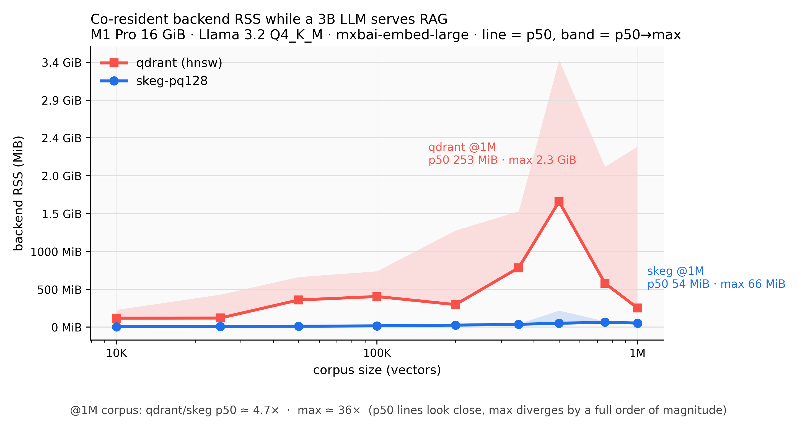

<!-- markdownlint-disable MD033 MD041 -->
<p align="center">
  
</p>

<p align="center">
  <strong>The vector database that fits.</strong><br>
  Multi-tenant, disk-first, RAM-frugal &mdash; recall 1.0 at a fraction of the memory.
</p>

<p align="center">
  <a href="https://crates.io/crates/skeg-server"></a>
  <a href="https://github.com/skegdb/skeg/releases"></a>
  <a href="https://github.com/skegdb/skeg/actions"></a>
  
  <a href="LICENSE"></a>
  <a href="https://github.com/skegdb/skeg-bench"></a>
</p>
<!-- markdownlint-enable MD033 MD041 -->

---

Vector search where RAM is contested: a SaaS packing thousands of tenants on one
box, a RAG service paying for memory by the gigabyte, an agent sharing a machine
with the model it serves. skeg keeps the full vectors on SSD and only a small,
quantized working set in RAM — so it serves at **recall 1.0** on a memory
footprint the RAM-resident engines can't touch.

Key-value and vectors in one engine. Redis-compatible wire protocol. First-class
multi-tenancy with isolation that's leak-free by construction.

## Why it matters

The same 50M-vector workload, RAM provisioned at $4/GB-month:

| | resident RAM | cost / year |
| --- | ---: | ---: |
| **skeg** (tq2) | **19 GiB** | **$930** |
| Qdrant (HNSW, f32) | 201 GiB | $9,647 |

**90% less memory, same recall.** That gap is a larger model, a longer context,
a second service — or a smaller bill. Run the numbers for your workload with
[`skeg-bench`](https://github.com/skegdb/skeg-bench)'s cost calculator.

## Benchmarks

All numbers are reproducible from [`skeg-bench`](https://github.com/skegdb/skeg-bench)
(public harness, real embeddings, brute-force ground truth). Measured single-machine
on Apple Silicon; the RAM ratios are hardware-independent.

**Lean *and* fast.** Single-tenant, 100K × 1024-dim, recall against exact brute
force. Every engine at a reasonable default (LanceDB tuned to recall 1.0 for a
fair fight):

| engine | serve RAM | recall@10 | p50 latency |
| --- | ---: | ---: | ---: |
| **skeg** (tq2) | **47 MB** | **1.000** | **2.5 ms** |
| Milvus Lite | 108 MB | 0.934 | 2.7 ms |
| LanceDB (IVF-PQ) | 198 MB | 0.998 | 59 ms |
| hnswlib (raw HNSW) | 426 MB | 0.985 | 2.0 ms |
| Chroma (HNSW) | 682 MB | 0.985 | 3.9 ms |
| Qdrant (HNSW, f32) | 885 MB | 0.997 | 2.6 ms |

Every other engine gives up at least one axis — RAM, recall, or latency. skeg is
the only one that is leanest, most accurate, *and* fast at once. The Pareto
across all six is in [`skeg-bench`](https://github.com/skegdb/skeg-bench).

**Multi-tenant density.** Pack tenants of 100K vectors on one box. skeg's RAM is
bounded by the *largest tenant*, not the total — it stays flat as tenants grow:

| 5 tenants × 100K | peak RAM | recall | cross-tenant leaks |
| --- | ---: | ---: | ---: |
| **skeg** (per-tenant index) | **~200 MB** | **1.000** | **0** |
| Qdrant (collection per tenant) | 1,818 MB | 0.996 | 0 |
| Qdrant (shared + filter) | 3,494 MB | 0.957 | 0 |

That's **9–17× less RAM at higher recall** — and isolation that holds under an
adversarial leak-fuzz (query a tenant's index with another tenant's exact
vector: zero rows cross the boundary, every time).

**Fits where others fall over.** MNIST 60K in a hard 256 MB container:

| | peak RAM | verdict @ 256 MB |
| --- | ---: | :---: |
| **skeg** (tq2) | **156 MB** | ✅ PASS |
| Qdrant (f32) | 473 MB | ❌ OOM-killed |

**Co-resident with a model.** A 3B LLM answering RAG over 1M vectors, both on one
M1 Pro (16 GiB) — the index stays on SSD, the resident set stays flat:

| Co-resident, 1M vectors | backend RSS p50 | backend RSS max |
| --- | ---: | ---: |
| **skeg** (pq128) | **54 MiB** | **67 MiB** |
| Qdrant (HNSW) | 254 MiB | 2,387 MiB |

<!-- markdownlint-disable MD033 MD041 -->
<p align="center">
  
</p>
<!-- markdownlint-enable MD033 MD041 -->

Full matrix (engine × scale × tier, p50/p99, recall, RSS) on the live dashboard:
[`skegdb.github.io/bench`](https://skegdb.github.io/bench/).

## How it works

The index lives on the SSD. The Vamana graph is walked on disk with a small,
byte-budgeted cache for the hot pages; the cache is S3-FIFO and returns evicted
pages to the OS through jemalloc decay timers. A resident quantized tier drives
the graph walk, and re-ranking against the full-precision vectors on disk
recovers the accuracy quantization gives up.

Five tiers trade memory for precision: `int8`, Product Quantization (128×256),
and TurboQuant at 1/2/4 bits per coordinate. **tq2 is the sweet spot** — quarter
the bytes of int8, recall ~1.0, latency on par. TurboQuant needs no trained
codebook, so the lean tiers work under live writes, not just at serve time.

The design and the eleven falsifications behind it are written up in
[the series on the project blog](https://amanitaproject.com/).

## Multi-tenancy

Multi-tenancy is first-class, not a filter convention:

- **Isolation by construction** — one index per tenant, so a query physically
  cannot reach another tenant's vectors. No filter to misconfigure, no leak path.
- **Hard quotas** — `max_vectors`, `max_disk_bytes`, set and read at runtime via
  `SKEG.QUOTA.SET` / `SKEG.QUOTA.GET`.
- **Fair eviction** — a noisy tenant can't starve a quiet one out of the cache.
- **Authentication** — `HELLO 3 AUTH user pass` (argon2id), prefix-routed namespaces.

Shipped in the `skeg-tenant`, `skeg-server-tenant`, and `skeg-multi-tenant`
crates. See [`docs/multi-tenancy.md`](docs/multi-tenancy.md).

## Install

### Homebrew (macOS and Linux ARM)

```sh
brew tap skegdb/tap
brew install skeg
```

Installs both binaries (`skeg`, `skeg-resp3`) and a launchd/systemd service.

### From crates.io

```sh
cargo install skeg-server
```

Compiles from source and installs `skeg` and `skeg-resp3` into `$CARGO_HOME/bin`.
Requires a Rust toolchain (MSRV 1.88).

<!-- markdownlint-disable MD033 -->
<details>
<summary>Tarball, source, Docker, and the published crate list</summary>

#### Pre-built tarball

```sh
TARGET=aarch64-apple-darwin   # or aarch64-unknown-linux-gnu
curl -L -o skeg.tar.gz \
  "https://github.com/skegdb/skeg/releases/latest/download/skeg-$(curl -s https://api.github.com/repos/skegdb/skeg/releases/latest | grep tag_name | cut -d'"' -f4)-${TARGET}.tar.gz"
tar -xzf skeg.tar.gz
./skeg --help
```

SHA256 checksums are published alongside each tarball (`.sha256` suffix). Pin a
version from the [releases page](https://github.com/skegdb/skeg/releases).

#### From source

```sh
git clone https://github.com/skegdb/skeg
cd skeg
cargo build --release --bin skeg --bin skeg-resp3
```

Requires Rust 1.88+. Binaries land at `target/release/skeg` and `target/release/skeg-resp3`.

#### Docker

```sh
docker run -d --name skeg \
  -p 7379:7379 \
  -v skeg-data:/var/lib/skeg \
  ghcr.io/skegdb/skeg:latest
```

Bundles both binaries (`skeg` native on 7379, `skeg-resp3` Redis-compat on 6379).
Default entrypoint is `skeg`; for RESP3 override with `--entrypoint
/usr/local/bin/skeg-resp3` and publish 6379. Built for `linux/arm64`. An Ollama
companion setup lives in [`docker-compose.example.yml`](docker-compose.example.yml).

#### Published crates

`skeg-proto`, `skeg-simd`, `skeg-platform`, `skeg-telemetry`, `skeg-resp3`,
`skeg-core`, `skeg-vector`, `skeg-server`, `skeg-tenant`, `skeg-server-tenant`,
`skeg-multi-tenant`. Network adapters: [`skeg-rigging`](https://github.com/skegdb/skeg-rigging),
[`skeg-rigging-net`](https://github.com/skegdb/skeg-rigging-net).

</details>
<!-- markdownlint-enable MD033 -->

## Quickstart

```sh
skeg --data-dir ./data --addr 127.0.0.1:7379 &       # native protocol
skeg-resp3 --data-dir ./data --addr 127.0.0.1:6379 & # Redis-compatible
```

Key-value through any Redis client:

```text
$ redis-cli -3 -p 6379
> SET greeting "hello"
OK
> INCRBY counter 7
(integer) 7
```

Vectors are namespaced under `SKEG.*` to stay out of the Redis command surface:

```text
> SKEG.VINDEX.CREATE docs 1024 tq2 disk
OK
> SKEG.VSET docs 1 <1024-float vector as bytes>
OK
> SKEG.VSEARCH docs 10 100 <query vector bytes>
1) "1"
2) (double) 0.987
...
```

Runnable client examples (ingest, multi-tenant, filtered search) live in
[`skeg-bench/examples`](https://github.com/skegdb/skeg-bench/tree/main/examples).

<!-- markdownlint-disable MD033 -->
<details>
<summary>Command reference</summary>

`SKEG.VINDEX.CREATE <name> <dim> <kind> <backend>`. `kind` selects the index
storage / tier: `f32 | int8 | tq1 | tq2 | tq4 | binary`. `backend` chooses
in-RAM flat scan or on-disk Vamana: `flat | disk`. The vector in `SKEG.VSET` /
`SKEG.VSEARCH` is a raw byte buffer on the native protocol, a bulk string on RESP3.

Filtered search (RESP3): `SKEG.VSET <name> <id> <vector> [PAYLOAD <blob>]`
attaches `key=value` fields; `SKEG.VSEARCH <name> <k> <l_search> <query>
[WITHPAYLOAD] [FILTER <expr>]` returns payloads and/or restricts to matches. The
grammar covers `=`, `IN (...)`, ranges `>= > <= < BETWEEN a AND b`, `EXISTS`, and
`AND` / `OR` / `NOT` with parentheses. See [`docs/filtered-search.md`](docs/filtered-search.md).

</details>
<!-- markdownlint-enable MD033 -->

## Status

**Shipping today.** KV and vector ops on both protocols; filtered vector search
with the full filter grammar; first-class multi-tenancy with quotas and fair
eviction; three durability tiers (relaxed / kernel / power-loss); Prometheus
metrics and OTLP tracing; a workspace test suite that's clean under
`cargo clippy --workspace --all-targets`.

**Honest about the edges.** skeg is not the lowest-latency *single-query* engine
— Qdrant is comparable on p99 and raw hnswlib is faster still. Throughput per
process scales with concurrency to a per-process ceiling, then you scale out with
more processes; measure your own with `runner.py throughput` in
[`skeg-bench`](https://github.com/skegdb/skeg-bench). Cold bulk-loading a fresh
index is rebuild-based and trades build time for the lean serving footprint.
Release binaries are aarch64 (Apple Silicon, Linux ARM); the source builds on
x86_64 but AVX2/AVX-512 tuning and native Linux validation are on the roadmap,
not done.

## Documentation

Long-form design and benchmark write-ups on the [project blog](https://amanitaproject.com/):
*Constraints as Method*, *Seven More Hypotheses*, *The Substrate*, *What Was Measured*.

Operational guides in [`docs/`](docs/):

- [`docs/multi-tenancy.md`](docs/multi-tenancy.md) — tenants, key scoping, quotas, fair eviction.
- [`docs/filtered-search.md`](docs/filtered-search.md) — payloads, filter grammar, the planner.
- [`docs/observability.md`](docs/observability.md) — Prometheus, OTel, tracing.
- [`docs/ecosystem.md`](docs/ecosystem.md) — federation (hansa) and ingest pipelines.

Reproducible benchmark suite: [`skeg-bench`](https://github.com/skegdb/skeg-bench).
Live dashboard: [`skegdb.github.io/bench`](https://skegdb.github.io/bench/).

## Roadmap

Driven by what real workloads ask for first:

- x86_64 native tuning (AVX2 / AVX-512) and native Linux validation.
- Incremental insert to close the cold-build gap.
- Child spans for the VSEARCH internals through the OTLP exporter.
- GPU acceleration for the kernels, once the host environment makes it sensible.

## Contributing

Bug reports, design discussions, and pull requests are welcome. Run `cargo fmt`,
`cargo clippy --workspace --all-targets -- -D warnings`, and `cargo test
--workspace` before opening a PR. A pre-push hook at `.githooks/pre-push` runs
the same three locally — enable with `git config core.hooksPath .githooks`
(bypass a docs-only push with `SKIP_PREPUSH=1`).

## Security

Report security issues by opening an issue with a brief description and a request
to take the conversation private. See [`SECURITY.md`](SECURITY.md).

## License

[Apache-2.0](LICENSE). See [`NOTICE`](NOTICE) for attribution.
