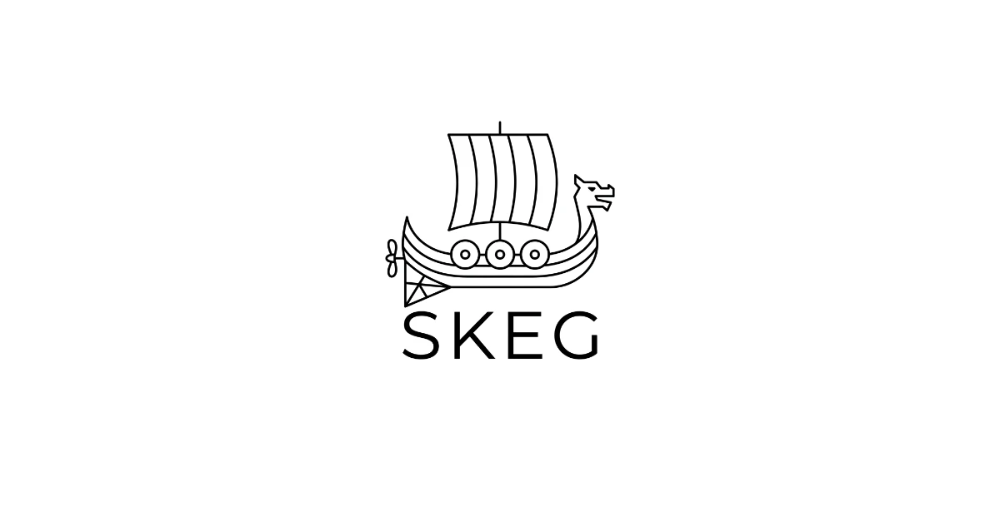
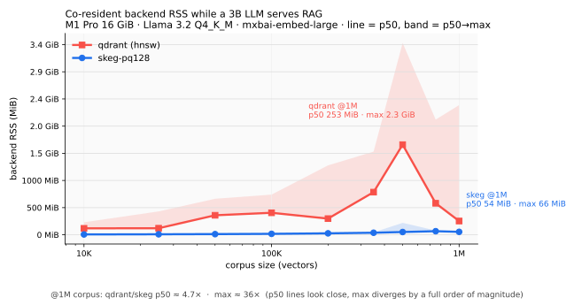

<!-- markdownlint-disable MD033 MD041 -->
<p align="center">
  
</p>

<p align="center">
  <strong>The vector database that fits.</strong><br>
  Recall 1.0 without holding the corpus in RAM.<br>
  Tenants isolated by construction, vectors and key-value in one process.
</p>

<p align="center">
  <a href="https://crates.io/crates/skeg-server"></a>
  <a href="https://github.com/skegdb/skeg/releases"></a>
  <a href="https://github.com/skegdb/skeg/actions"></a>
  
  <a href="LICENSE"></a>
  <a href="https://github.com/skegdb/skeg-bench"></a>
</p>

<p align="center">
  <a href="https://www.producthunt.com/products/github-449?embed=true&amp;utm_source=badge-featured&amp;utm_medium=badge&amp;utm_campaign=badge-skeg" target="_blank" rel="noopener noreferrer"></a>
</p>
<!-- markdownlint-enable MD033 MD041 -->

---

skeg is a vector database and key-value store in one process, speaking the Redis
protocol. The full vectors stay on SSD and only a small quantized working set
sits in RAM, so memory grows far more slowly than the corpus it serves.

[Documentation](docs/) &middot;
[Benchmarks](https://skegdb.github.io/bench/) &middot;
[Getting started](docs/getting-started.md) &middot;
[Roadmap](docs/roadmap.md)

## Quickstart

```sh
docker run -d --name skeg -p 127.0.0.1:6379:6379 -v skeg-data:/var/lib/skeg \
  -e SKEG_ALLOW_UNAUTHENTICATED_NETWORK=1 \
  --entrypoint /usr/local/bin/skeg-resp3 ghcr.io/skegdb/skeg:latest \
  --addr 0.0.0.0:6379
```

`--addr` is not optional here: that binary defaults to `127.0.0.1:6379`, which
inside a container only the container can reach. This server has no
authentication - anyone who can reach it can read, write and drop indices -
so binding `0.0.0.0` needs the explicit opt-in above; the same command
without it fails fast with an operator-facing message instead of starting
unprotected. The port is then published on the host's loopback interface
only. For network exposure, put `skeg-server-tenant` (with
`--tenant-auth`/`--tenant-strict`) or an authenticating proxy in front
instead of publishing the port directly.

It is a Redis server, so any Redis client works:

```console
$ redis-cli -3 SET greeting "hello"
OK
$ redis-cli -3 INCRBY counter 7
7
```

It is also a vector database. Vectors travel as raw little-endian f32, under
`SKEG.*` commands that stay clear of the Redis command surface:

```python
import struct, redis

r = redis.Redis(protocol=3)
vec = lambda *xs: struct.pack(f"<{len(xs)}f", *xs)

r.execute_command("SKEG.VINDEX.CREATE", "docs", 4, "tq2", "disk")
r.execute_command("SKEG.VSET", "docs", 1, vec(1.0, 0.0, 0.0, 0.0))
r.execute_command("SKEG.VSET", "docs", 2, vec(0.0, 1.0, 0.0, 0.0))
r.execute_command("SKEG.VSET", "docs", 3, vec(0.9, 0.1, 0.0, 0.0))

r.execute_command("SKEG.VSEARCH", "docs", 2, 32, vec(1.0, 0.0, 0.0, 0.0))
# [b'1', 1.0, b'3', 0.9938837289810181]
```

`tq2` is the 2-bit TurboQuant tier, `disk` the on-disk graph. That pairing is
what the benchmarks below measure. The full command reference and the filter
grammar are in [`docs/getting-started.md`](docs/getting-started.md).

## Why skeg

**Recall at the top of the field, without the corpus in RAM.** A quantized
proxy walks the graph and the shortlist is re-ranked from disk at full
precision, so the ranking is exact where it decides the answer while memory
tracks the working set rather than the corpus. Measured on real embeddings:
r@10 and r@100 at or above 0.993 from 100k to 400k across the tq2, tq1 and
int8 tiers, and 1.0000 on filtered search over eleven label shapes. A
semantically resharded set trades a little of that for locality - 0.988 at the
production beam - which is a real number and stated as one. That is what puts a vector store where it did not fit: many
tenants on one machine, or a RAG index beside the model answering from it.

- **Tenants that cannot leak into each other.** One index per tenant, so a query
  has no physical path to another tenant's vectors. Not a filter someone has to
  remember to apply. See [Multi-tenancy](#multi-tenancy).
- **Filters that stay exact as the corpus grows.** The match set is scored
  exactly rather than navigated approximately, so recall does not depend on a
  filter-aware graph: measured 1.0000 across eleven shapes including AND
  intersections. The cost is latency proportional to the match set, which the
  IVF route caps by scoring a shortlist instead - it does not remove the cost
  of materialising the match set itself. Payloads on the vectors, a
  grammar with ranges, sets and boolean composition, and a planner that reads
  the size of the match set and picks the cheapest correct strategy. Work scales
  with the shortlist, not with the number of matches.
- **Vectors and key-value in the same process.** One protocol, one thing to
  deploy, one thing to back up. No cache in front, no second database beside it.
- **Six tiers, chosen per index.** Exact `f32` down to 1-bit, so a hot index and
  a cold archive can share a server at the memory each deserves.

100K vectors at 1024 dimensions, recall against exact brute force, every engine
at its default configuration, LanceDB tuned to recall 1.0:

| engine | serve RAM | recall@10 | p50 latency |
| --- | ---: | ---: | ---: |
| **skeg** (tq2) | **47 MB** | **1.000** | **2.5 ms** |
| Milvus Lite | 108 MB | 0.934 | 2.7 ms |
| LanceDB (IVF-PQ) | 198 MB | 0.998 | 59 ms |
| hnswlib (raw HNSW) | 426 MB | 0.985 | 2.0 ms |
| Chroma (HNSW) | 682 MB | 0.985 | 3.9 ms |
| Qdrant (HNSW, f32) | 885 MB | 0.997 | 2.6 ms |

The same latency band as the fastest servers there, at a fraction of the memory.
Which is what makes co-residency work: a 3B LLM answering RAG over 1M vectors,
both on one M1 Pro (16 GiB), index on SSD, with the resident set flat under
read traffic. Under sustained WRITE churn it is not flat: the delta and the
runs are memory, and the figures below are read-side.

| Co-resident, 1M vectors | backend RSS p50 | backend RSS max |
| --- | ---: | ---: |
| **skeg** (pq128) | **54 MiB** | **67 MiB** |
| Qdrant (HNSW) | 254 MiB | 2,387 MiB |

<!-- markdownlint-disable MD033 MD041 -->
<p align="center">
  
</p>
<!-- markdownlint-enable MD033 MD041 -->

Every number is reproducible from [`skeg-bench`](https://github.com/skegdb/skeg-bench):
public harness, real embeddings, brute-force ground truth. Measured
single-machine on Apple Silicon; the RAM ratios are hardware-independent. The
full matrix, plus the multi-tenant and container-OOM runs, is on the
[dashboard](https://skegdb.github.io/bench/).

## Why not skeg

- **Single-query latency.** 2.5 ms p50 is competitive, not a record. Qdrant
  matches it at p99 and raw hnswlib beats it. If a few hundred microseconds
  decide your design, measure both.
- **Throughput per process.** One process saturates near 780 QPS at 1024
  dimensions. Past that you add processes, not threads.
- **Cold bulk-loads.** Loading a fresh corpus builds the graph rather than
  streaming into a finished one, so the first load costs more than the writes
  that follow it.

If memory is not the resource you are short of, none of this costs you anything:
you still get recall 1.0 at competitive latency. You just will not notice the
part skeg is built for.

## Multi-tenancy

Tenancy is a property of the storage layout, not a filter convention. Each
tenant gets its own index, and an adversarial leak-fuzz holds it to that: query
one tenant's index with another tenant's exact vector, and zero rows cross the
boundary, every time.

- Hard quotas: `max_vectors` and `max_disk_bytes`, set and read at runtime
  through `SKEG.QUOTA.SET` / `SKEG.QUOTA.GET`. `max_disk_bytes` bounds the
  tenant's live vLog bytes - KV values and vector payload blobs, one counter
  shared across shards - and it bounds them against internal maintenance as
  well as client writes: a boundary replica that would not fit is skipped
  rather than written. It does not cover the vector index files themselves,
  which `max_vectors` bounds instead, nor dead records still waiting for
  compaction. [What is inside the number, and what is
  not.](docs/multi-tenancy.md#per-tenant-quotas)
- Fair eviction, so a noisy tenant cannot starve a quiet one out of the cache.
- Authentication via `HELLO 3 AUTH user pass` (argon2id), with prefix-routed
  namespaces.

Details in [`docs/multi-tenancy.md`](docs/multi-tenancy.md).

## Install

The quickstart above pulls the container. The other routes:

```sh
brew tap skegdb/tap && brew install skeg     # macOS and Linux ARM
cargo install skeg-server                    # from source, MSRV 1.88
```

Homebrew installs both binaries and a launchd/systemd service. `cargo install`
puts them in `$CARGO_HOME/bin`.

Pre-built tarballs, one per platform, with a `.sha256` beside each:

```sh
TARGET=aarch64-apple-darwin   # see Platforms for the full list
TAG=$(curl -s https://api.github.com/repos/skegdb/skeg/releases/latest | grep tag_name | cut -d'"' -f4)
curl -L -o skeg.tar.gz \
  "https://github.com/skegdb/skeg/releases/latest/download/skeg-${TAG}-${TARGET}.tar.gz"
tar -xzf skeg.tar.gz && ./skeg --help
```

Or from a checkout:

```sh
git clone https://github.com/skegdb/skeg && cd skeg
cargo build --release --bin skeg --bin skeg-resp3
```

The image carries both binaries. Its default entrypoint is `skeg`, the native
protocol, already bound to `0.0.0.0:7379`; the quickstart overrides that for
RESP3. An Ollama companion setup lives in
[`docker-compose.example.yml`](docker-compose.example.yml).

## Platforms

| your machine | tarball | container |
| --- | --- | --- |
| Mac, Apple Silicon | `aarch64-apple-darwin` | not published |
| Linux, ARM | `aarch64-unknown-linux-gnu` | `:latest` |
| Linux, x86_64 | `x86_64-unknown-linux-gnu` | `:latest` |

`:latest` carries both Linux architectures and resolves the right one on
`docker pull`. There is no Intel Mac or Windows build.

One binary per platform, and it adapts: skeg checks the CPU and picks NEON,
AVX-512, AVX2 or a scalar fallback accordingly. The x86_64 build carries the
AVX-512 kernels, and CI runs that build on a machine without AVX-512, so
"carries them" cannot quietly become "requires them".

Building from source is the one place this is a choice, because those kernels
need Rust 1.89 while the rest of the project builds on 1.88. They sit behind a
feature flag so the lower toolchain keeps working:

```sh
cargo build --release --bin skeg --bin skeg-resp3 --features skeg-server/avx512
```

Which kernel runs on which instruction set, and why some are built but
deliberately not selected, is asserted in a test rather than described in prose:
`cargo test -p skeg-simd --test coverage`.

## Protocols

Build against **RESP3**. It is the supported public API and names the vector
tiers directly: `f32`, `int8`, `tq1`, `tq2`, `tq4`, `binary`.

The native transport on 7379 is for specialised clients, and its version decides
which tiers it can name:

| | v1 | v2 |
| --- | --- | --- |
| kinds | `0=f32` `1=int8` `2=binary` | the same, plus `3=tq1` `4=tq2` `5=tq4` |
| kind `3` | rejected: historical clients used it for PQ | `tq1` |

A v2 client opens with `NativeHello` (op `0x84`) and reads the tier capability
mask it gets back. No v1 byte changed meaning, so existing clients keep working.

## Documentation

- [`getting-started.md`](docs/getting-started.md): run it, command reference, filter grammar.
- [`architecture.md`](docs/architecture.md): on-disk index, tiers, filtered-search planner.
- [`multi-tenancy.md`](docs/multi-tenancy.md): tenants, key scoping, quotas, fair eviction.
- [`filtered-search.md`](docs/filtered-search.md): payloads, filter grammar, the planner.
- [`observability.md`](docs/observability.md): Prometheus, OTel, tracing.
- [`operations.md`](docs/operations.md): memory limits, graceful stop, Docker/systemd runbook.
- [`ecosystem.md`](docs/ecosystem.md): federation (hansa) and ingest pipelines.
- [`roadmap.md`](docs/roadmap.md): planned, conditional, and deliberately not.

Long-form design and benchmark write-ups are on the
[project blog](https://amanitaproject.com/): *Constraints as Method*, *Seven More
Hypotheses*, *The Substrate*, *What Was Measured*.

Published crates: `skeg-proto`, `skeg-simd`, `skeg-platform`, `skeg-telemetry`,
`skeg-resp3`, `skeg-core`, `skeg-vector`, `skeg-server`, `skeg-tenant`,
`skeg-server-tenant`, `skeg-multi-tenant`. Network adapters live in
[`skeg-rigging`](https://github.com/skegdb/skeg-rigging) and
[`skeg-rigging-net`](https://github.com/skegdb/skeg-rigging-net).

## Contributing

Bug reports, design discussions, and pull requests are welcome. Before opening a
PR run `cargo fmt`, `cargo clippy --workspace --all-targets -- -D warnings`, and
`cargo test --workspace`. The pre-push hook at `.githooks/pre-push` runs the same
three; enable it with `git config core.hooksPath .githooks` (a docs-only push can
skip it with `SKIP_PREPUSH=1`).

## Security

Report security issues by opening an issue with a brief description and a request
to take the conversation private. See [`SECURITY.md`](SECURITY.md).

## License

[Apache-2.0](LICENSE). See [`NOTICE`](NOTICE) for attribution.
